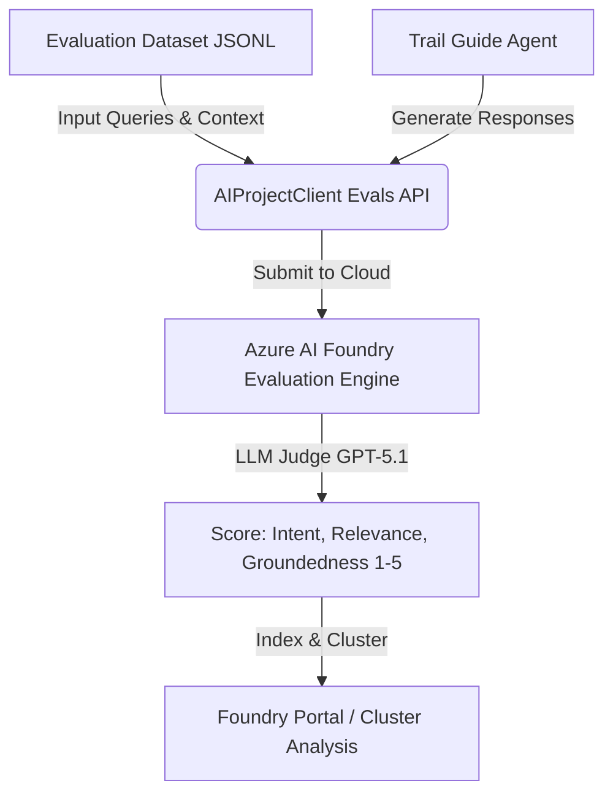
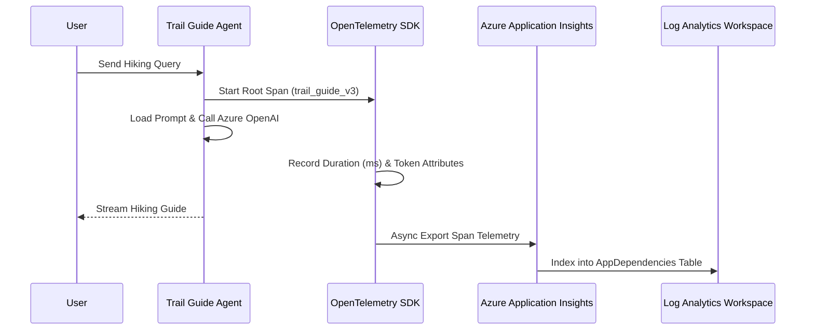

# Microsoft AI-300 Exam Preparation Guide
## Deep-Dive Study Notes & Practice Questions: GenAI Agent Evaluation, Monitoring & Observability

> [!IMPORTANT]
> **Exam Relevance:** This document provides comprehensive study notes and scenario-based exam questions for the **Microsoft AI-300 (Designing and Implementing an Azure AI Solution / Azure AI Foundry & GenAI Operations)** certification. It focuses specifically on **Lab 03 (Evaluating Generative AI Agents)** and **Lab 04 (Monitoring and Distributed Tracing)** using Azure AI Foundry, OpenTelemetry, and Azure Monitor.

---

## Part 1: Comprehensive Study Notes

### 1. Lab 03 Deep-Dive: Evaluating Generative AI Agents (`azure.ai.evaluation`)

In production GenAI Ops, relying on human evaluation is unscalable. Azure AI Foundry provides an automated evaluation framework utilizing **AI-assisted evaluators (LLM-as-a-Judge)**, **NLP metrics**, and **Safety/Risk evaluators**.

#### A. Core Evaluator Types & Architecture
1. **Quality Evaluators (LLM-as-a-Judge):**
   * Use a powerful model (e.g., GPT-4o or GPT-5.1) to grade agent responses on a **1 to 5 numerical scale**.
   * **`IntentResolutionEvaluator`**: Measures whether the agent correctly recognized and addressed the user's underlying intent.
   * **`RelevanceEvaluator`**: Measures how pertinent the response is to the query, penalizing off-topic or redundant details.
   * **`GroundednessEvaluator`**: Measures whether the claims in the response are strictly backed by the provided context/source documents. Crucial for detecting **hallucinations**.
2. **Safety & Risk Evaluators:**
   * Evaluate content for **Hate/Unfairness**, **Sexual Content**, **Self-Harm**, and **Violence**.
   * Output severity ratings (**Very Low, Low, Medium, High**) rather than 1–5 numerical scores.
3. **NLP & Traditional Evaluators:**
   * **`F1ScoreEvaluator`**, **`BleuScoreEvaluator`**, **`RougeScoreEvaluator`**, **`GleouScoreEvaluator`**: Measure lexical overlap against ground-truth reference strings.

#### B. Local vs. Cloud Evaluation Workflow
* **Local Evaluation (`evaluate()` function):** Runs evaluator prompts locally or against your connected OpenAI endpoint without logging permanent run histories in the Foundry portal. Good for rapid unit testing.
* **Cloud Evaluation (`AIProjectClient.evals.runs.create()`):**
  * Submits evaluation datasets (JSONL/CSV) and target functions to Azure AI Foundry's evaluation service.
  * Generates an **Evaluation ID (`eval_...`)** and **Run ID (`evalrun_...`)**.
  * Results are permanently indexed and visualized in the Foundry web portal under **Build -> Evaluations**.



#### C. Cluster Analysis & Error Debugging in Foundry
> [!NOTE]
> **Crucial Exam Concept:** Why does Cluster Analysis show `Total Samples: 1, Passed: 0, Failed: 1` when your test suite had 89 items?
* **Cluster Analysis is exclusively an error-discovery tool.**
* It filters out all passing evaluations (scores $\ge 3$) and **only groups failed tests** (scores $< 3$) by root cause using AI embeddings.
* For example, if 88 items score 5/5 and 1 item scores 2/5 on Groundedness, Cluster Analysis will display **Total Samples = 1**, grouping it under a taxonomy node like `hallucinate` $\rightarrow$ `unsupported`.

---

### 2. Lab 04 Deep-Dive: Monitoring & Distributed Tracing (`azure.monitor.opentelemetry`)

Once an agent is deployed, continuous runtime observability is mandatory to track performance bottlenecks, token inflation, and system failures.

#### A. Distributed Tracing Architecture (OpenTelemetry + Application Insights)
Azure AI Foundry integrates natively with **OpenTelemetry (OTel)** and **Azure Monitor Application Insights**.
* **`AIProjectClient.telemetry.get_application_insights_connection_string()`**: Dynamically fetches the Application Insights ingestion endpoint and Instrumentation Key from your Foundry project workspace.
* **`configure_azure_monitor(connection_string=...)`**: Hooks OpenTelemetry into the Python runtime, automatically intercepting HTTP requests, OpenAI SDK calls, and custom span decorators (`@tracer.start_as_current_span`).
* **Span Hierarchy:**
  * **Root Span:** Represents the overall user request (e.g., `trail_guide_v3`).
  * **Child Spans (`AppDependencies`):** Represent individual internal operations: prompt formatting, tool executions, vector database lookups, and Azure OpenAI inference calls.



#### B. Key Performance Indicators (KPIs): Cost vs. Latency vs. Quality
When comparing prompt iterations (`v1` baseline, `v2` structured, `v3` verbose, `v4_optimized_concise`), GenAI engineers must balance three competing vectors:

| Metric | Measured By | Impact of Verbose Prompts (`v3`) | Impact of Concise Prompts (`v4`) |
| :--- | :--- | :--- | :--- |
| **Latency / TTFB / TTLB** | Duration (ms) in Trace Spans | **High (~9,000–14,000 ms)** due to lengthy output generation | **Low (~3,000–5,000 ms)** due to concise formatting |
| **Token Consumption** | `response.prompt_tokens`<br>`response.completion_tokens` | **High Cost** (Prompt tokens $>90\%$ of total volume) | **~47% Cost Reduction** in input prompt tokens |
| **Response Quality** | Lab 03 LLM Judge Scores | High Groundedness & Relevance | High Groundedness, zero fluff |

#### C. Navigating Observability in New vs. Classic Foundry UI
* **Classic UI:** `Tracing` and `Monitoring` are located on the left sidebar under *Observe and optimize*.
* **New Foundry UI:** Navigation is top-level (`Home | Discover | Build | Operate | Docs`).
  * **`Operate` $\rightarrow$ `Tracing`**: Visual waterfall tree of span execution flows.
  * **`Operate` $\rightarrow$ `Monitoring` $\rightarrow$ `Resource usage`**: Visual charts for Token Usage, Request Volume, and Latency trends.
* **Portal Indexing Lag:** The Azure AI Foundry portal has a **~5–10 minute display delay** for rendering new traces. To verify data immediately without waiting for the web UI, query the **`AppDependencies`** table in **Log Analytics** directly using Kusto Query Language (KQL) or `LogsQueryClient`.

#### D. Clean Decommissioning & Soft-Delete Purging (`azd down --force --purge`)
* **Standard Deletion (`az group delete` / `azd down`):** Deletes the resource group, but places Cognitive Services (Azure AI) and Azure Key Vaults into a **soft-delete recovery state** for up to 90 days.
* **Why Soft-Delete is Problematic:** Soft-deleted resources reserve their globally unique DNS names (preventing redeployment with the same name) and may continue to hold quota or cause billing confusion.
* **The `--purge` Flag:** Instructs Azure Developer CLI to bypass the soft-delete retention period and **permanently erase** the underlying assets immediately, guaranteeing zero recurring costs.

---

## Part 2: AI-300 Exam Practice Questions

### Section A: GenAI Agent Evaluation (Lab 03)

#### Question 1 (Scenario: Evaluator Selection)
You are designing an automated evaluation pipeline for an Azure AI Foundry customer support agent. The agent retrieves company policy documents from an Azure AI Search index and generates answers for customers. Recently, customers reported that the agent sometimes invents return policies that do not exist in the retrieved documents.
Which built-in AI-assisted quality evaluator should you prioritize monitoring to detect and eliminate this specific issue?

* **A)** `IntentResolutionEvaluator`
* **B)** `GroundednessEvaluator`
* **C)** `RelevanceEvaluator`
* **D)** `BleuScoreEvaluator`

<details>
<summary><b>Show Answer & Explanation</b></summary>

**Correct Answer:** **B) `GroundednessEvaluator`**

**Explanation:**
* **`GroundednessEvaluator`** measures whether the claims made in the AI model's response are strictly supported by the provided context (the retrieved policy documents). When an AI model invents facts not present in the source documents, this is known as a *hallucination* or *ungrounded claim*. Monitoring Groundedness directly detects this failure mode.
* **Why others are incorrect:**
  * **A (`IntentResolutionEvaluator`)**: Only evaluates whether the agent understood what the user was asking for, not whether the factual claims in the answer are accurate against source documents.
  * **C (`RelevanceEvaluator`)**: Evaluates whether the answer addresses the question without extra conversational fluff, but an answer can be highly relevant while still being entirely hallucinated/ungrounded.
  * **D (`BleuScoreEvaluator`)**: Measures exact n-gram lexical overlap against a static ground-truth string; it cannot evaluate semantic truth against dynamic RAG context.
</details>

---

#### Question 2 (Scenario: Interpreting Cluster Analysis)
You run a cloud evaluation job in Azure AI Foundry across a validation dataset consisting of **250 customer queries**. Your evaluation pipeline applies the `GroundednessEvaluator`, `RelevanceEvaluator`, and `IntentResolutionEvaluator` with a passing threshold of $\ge 3.0$ on a 1–5 scale.
When the job completes, you open the **Cluster Analysis** tab in the Azure AI Foundry portal. The dashboard displays:
`Total Samples: 4 | Passed: 0 | Failed: 4 | Clusters: 2`
A junior developer sees this and warns the team that the evaluation pipeline failed to process 246 out of the 250 queries.
What is the actual explanation for this dashboard display?

* **A)** The evaluation job timed out after processing 4 samples due to Azure OpenAI API rate limits (429 Too Many Requests).
* **B)** Cluster Analysis only indexes samples where all three evaluators resulted in a tie score.
* **C)** Cluster Analysis is designed to analyze only failed tests; exactly 246 queries passed all evaluations ($\ge 3.0$), and only the 4 failing queries ($< 3.0$) were clustered for debugging.
* **D)** The junior developer must switch the Foundry project filter from "All projects" to the specific workspace to see the remaining 246 passing samples.

<details>
<summary><b>Show Answer & Explanation</b></summary

**Correct Answer:** **C) Cluster Analysis is designed to analyze only failed tests; exactly 246 queries passed all evaluations ($\ge 3.0$), and only the 4 failing queries ($< 3.0$) were clustered for debugging.**

**Explanation:**
* In Azure AI Foundry, **Cluster Analysis (Analyze Results)** uses AI embeddings to group and categorize errors. It intentionally filters out passing evaluations so engineering teams can focus 100% of their attention on diagnosing root causes for failed edge cases (e.g., clustering under `hallucinate -> unsupported` or `off-topic`). Seeing 4 samples out of 250 in Cluster Analysis means your agent achieved an exceptional **98.4% pass rate**!
* **Why others are incorrect:**
  * **A & B**: Absolutely false; the evaluation job completed successfully.
  * **D**: While project filtering applies to global control plane views, inside an active evaluation run report, the sample count in Cluster Analysis strictly represents failing test cases.
</details>

---

#### Question 3 (Multiple Choice: Cloud vs. Local Evals)
In Azure AI Foundry SDK (`azure.ai.evaluation`), what is the primary technical distinction between running evaluations using `evaluate()` locally versus submitting them via `AIProjectClient.evals.runs.create()`?

* **A)** Local `evaluate()` can only use traditional NLP metrics (BLEU/ROUGE), whereas `AIProjectClient.evals.runs.create()` is required to use LLM-as-a-Judge evaluators.
* **B)** Local `evaluate()` executes evaluators in your local Python environment and outputs results to local memory/files, whereas `AIProjectClient.evals.runs.create()` executes the evaluation pipeline in Azure's cloud infrastructure and permanently indexes the Run ID and scores in the Foundry portal.
* **C)** Submitting via `AIProjectClient.evals.runs.create()` is free of charge, whereas local `evaluate()` incurs token charges on your Azure OpenAI endpoint.
* **D)** Local `evaluate()` requires an Application Insights connection string, whereas cloud evaluation does not.

<details>
<summary><b>Show Answer & Explanation</b></summary>

**Correct Answer:** **B) Local `evaluate()` executes evaluators in your local Python environment and outputs results to local memory/files, whereas `AIProjectClient.evals.runs.create()` executes the evaluation pipeline in Azure's cloud infrastructure and permanently indexes the Run ID and scores in the Foundry portal.**

**Explanation:**
* The standalone `evaluate()` function runs evaluator prompts directly from your local machine/CI-CD runner against your LLM endpoint and returns a local dictionary/dataframe. Submitting via `AIProjectClient.evals.runs.create()` registers an official cloud evaluation run, creating a permanent audit trail, graphical score charts, and cluster analysis inside the Azure AI Foundry web interface.
* **Why others are incorrect:**
  * **A**: Local `evaluate()` fully supports LLM-as-a-Judge evaluators (like Groundedness and Relevance) as long as an OpenAI model config is provided.
  * **C**: Both methods consume tokens on the underlying evaluator LLM deployment (e.g., GPT-4o or GPT-5.1) and incur standard inference costs.
  * **D**: Application Insights is used for runtime monitoring/tracing (Lab 04), not as a prerequisite for local evaluation.
</details>

---

#### Question 4 (Scenario: Safety & Risk Thresholds)
Your enterprise is deploying an AI agent for financial counseling. You must ensure that the agent never outputs content related to self-harm or violence. You configure the built-in `ViolenceEvaluator` and `SelfHarmEvaluator` in your validation pipeline.
Unlike quality evaluators that return a score from 1 to 5, how do built-in safety evaluators report risk levels in Azure AI Foundry?

* **A)** A binary boolean score (`True` for safe, `False` for unsafe).
* **B)** A percentage probability from `0.0%` to `100.0%`.
* **C)** A categorical severity level: `Very Low`, `Low`, `Medium`, or `High`.
* **D)** A HTTP status code (`200 OK` for safe, `403 Forbidden` for unsafe).

<details>
<summary><b>Show Answer & Explanation</b></summary>

**Correct Answer:** **C) A categorical severity level: `Very Low`, `Low`, `Medium`, or `High`.**

**Explanation:**
* In Azure AI Foundry, built-in Safety and Risk evaluators (Hate/Unfairness, Sexual, Self-Harm, Violence) classify content into four distinct severity tiers: **Very Low**, **Low**, **Medium**, and **High**. In production guardrails and evaluation reporting, any threshold at **Medium** or **High** is typically flagged as a safety violation or failure.
</details>

---

### Section B: Monitoring, Tracing & Observability (Lab 04)

#### Question 5 (Scenario: OpenTelemetry Setup)
You are tasked with instrumenting a Python-based GenAI agent to export distributed traces and token consumption metrics to Azure Application Insights. You have already installed `azure-monitor-opentelemetry` and initialized your `AIProjectClient`.
Which exact code sequence correctly dynamically configures OpenTelemetry auto-instrumentation using your Azure AI Foundry project credentials?

* **A)**
  ```python
  from azure.monitor.opentelemetry import configure_azure_monitor
  connection_string = project_client.telemetry.get_application_insights_connection_string()
  configure_azure_monitor(connection_string=connection_string)
  ```
* **B)**
  ```python
  from azure.ai.projects import configure_tracing
  configure_tracing(endpoint=project_client.endpoint)
  ```
* **C)**
  ```python
  import opentelemetry
  opentelemetry.enable_azure_foundry_monitoring(project_id=project_client.project_id)
  ```
* **D)**
  ```python
  from azure.monitor.opentelemetry import configure_azure_monitor
  configure_azure_monitor(workspace_id=project_client.get_workspace_id())
  ```

<details>
<summary><b>Show Answer & Explanation</b></summary>

**Correct Answer:** **A)**
```python
from azure.monitor.opentelemetry import configure_azure_monitor
connection_string = project_client.telemetry.get_application_insights_connection_string()
configure_azure_monitor(connection_string=connection_string)
```

**Explanation:**
* The `AIProjectClient.telemetry.get_application_insights_connection_string()` helper method retrieves the exact Application Insights connection string (containing the `InstrumentationKey` and `IngestionEndpoint`) associated with your Foundry project. Passing this string into `configure_azure_monitor()` initializes the OpenTelemetry SDK, automatically instrumenting HTTP libraries, OpenAI SDK clients, and custom spans.
* **Why others are incorrect:**
  * **B & C**: These functions and modules do not exist in the Azure/OpenTelemetry Python SDKs.
  * **D**: `configure_azure_monitor()` requires a `connection_string` keyword argument, not a Log Analytics `workspace_id`.
</details>

---

#### Question 6 (Scenario: Debugging Portal Indexing Lag)
You deploy a new prompt version (`v4_optimized_concise`) to your Trail Guide Agent and execute a test script that runs 20 model interactions. Your script completes successfully, and your local console shows that OpenTelemetry exported all trace spans without errors.
You immediately open the Azure AI Foundry web portal, navigate to **Operate -> Tracing**, and click **Refresh**. The page displays:
`Try logging new data or changing your filters to see results.`
You verify that your time filter is set correctly to **Last day**. What is the most technically sound explanation and next step?

* **A)** OpenTelemetry spans are only exported if the agent throws an unhandled exception; because all 20 interactions succeeded, no spans were generated.
* **B)** The Azure AI Foundry web portal has an inherent **~5 to 10 minute display and indexing lag** for rendering graphical trace trees. To immediately verify that spans were ingested, query the `AppDependencies` table in Azure Log Analytics using KQL.
* **C)** You must restart the Azure AI Foundry Hub cluster before new prompt version strings can be indexed by Application Insights.
* **D)** In the New Foundry UI, tracing is disabled by default; you must toggle back to the Classic UI to view trace waterfalls.

<details>
<summary><b>Show Answer & Explanation</b></summary>

**Correct Answer:** **B) The Azure AI Foundry web portal has an inherent **~5 to 10 minute display and indexing lag** for rendering graphical trace trees. To immediately verify that spans were ingested, query the `AppDependencies` table in Azure Log Analytics using KQL.**

**Explanation:**
* While Azure Application Insights ingests telemetry rapidly, the graphical Tracing waterfall UI in the Azure AI Foundry portal relies on background indexing services that typically exhibit a **5 to 10 minute delay**. Microsoft Learn explicitly highlights this operational reality. To bypass the UI delay and verify ingestion instantaneously, engineers query the underlying **`AppDependencies`** table in Log Analytics directly using KQL or the Python `LogsQueryClient`.
* **Why others are incorrect:**
  * **A**: OpenTelemetry exports spans for all instrumented operations (successful or failed).
  * **C**: There is no "Hub cluster" to restart; ingestion is handled asynchronously by Azure Monitor.
  * **D**: Both New and Classic Foundry UIs read from the exact same Application Insights data source.
</details>

---

#### Question 7 (Scenario: Token Cost Optimization)
You are evaluating two prompt versions for an interactive AI trail guide:
* **`v3_verbose`**: Uses extensive system instructions, examples, and formatting rules. Average usage per request: **1,650 prompt tokens** and **1,400 completion tokens**. Average latency: **11,200 ms**.
* **`v4_optimized_concise`**: Uses streamlined system instructions with zero semantic fluff. Average usage per request: **880 prompt tokens** and **1,350 completion tokens**. Average latency: **8,900 ms**.

When analyzing your Azure Cost Management and Token Usage dashboards under **Monitoring -> Resource usage**, you observe that **Prompt Tokens represent over 85% of your total token consumption** across your application lifecycle.
Which conclusion is most accurate regarding the migration from `v3` to `v4`?

* **A)** Migrating to `v4` will have negligible impact on financial cost because completion tokens are more expensive than prompt tokens, and completion tokens only dropped by 50.
* **B)** Migrating to `v4` provides a substantial financial and performance optimization, slashing input prompt token consumption by **~46.7%** and reducing execution latency by **~2,300 ms** per request without sacrificing core output completeness.
* **C)** Migrating to `v4` will increase latency because the model must spend extra internal compute cycles deducing formatting rules that were omitted from the prompt.
* **D)** You should keep `v3` because Azure OpenAI bills exclusively per API request, regardless of the number of prompt or completion tokens processed.

<details>
<summary><b>Show Answer & Explanation</b></summary>

**Correct Answer:** **B) Migrating to `v4` provides a substantial financial and performance optimization, slashing input prompt token consumption by **~46.7%** and reducing execution latency by **~2,300 ms** per request without sacrificing core output completeness.**

**Explanation:**
* In Azure OpenAI and GenAI Ops, billing is calculated per 1,000 tokens (separated into input/prompt tokens and output/completion tokens). When an application's workload is heavily skewed toward input tokens (85%+ of volume), cutting prompt tokens from 1,650 down to 880 ($\approx 46.7\%$ reduction) directly slashes your recurring cloud bill. Furthermore, processing fewer input tokens reduces Time-to-First-Byte (TTFB) and overall inference duration.
* **Why others are incorrect:**
  * **A**: While output tokens carry a higher unit price per 1k than input tokens, when input volume is 6x to 10x larger than output volume, input token reduction is the primary driver of cost savings.
  * **C**: Real-world telemetry proves `v4` reduced latency from 11.2s to 8.9s.
  * **D**: Azure OpenAI is billed on token volume (pay-as-you-go or PTU), never a flat rate per request.
</details>

---

#### Question 8 (Scenario: Navigating the Control Plane)
An Azure AI engineer logs into the redesigned **New Foundry UI** (`ai.azure.com`) to inspect token usage trends and error rates for a specific project named `ai-project-prod`.
When they click **Operate** in the top navigation bar, the dashboard displays:
`Non-Foundry agent data is always displayed. Select a project to view Foundry data.`
`No data to show`
Why is the engineer seeing "No data to show", and how should they resolve it?

* **A)** The Application Insights resource has been deleted; they must run `azd up` to reprovision telemetry.
* **B)** They are currently viewing the global subscription-level control plane where the project filter is set to **`All projects`**; they must select **`ai-project-prod`** from the project filter dropdown (or switch off New Foundry) to load project-level metrics.
* **C)** Token usage metrics are only available in Azure Cost Management, never inside Azure AI Foundry.
* **D)** The engineer lacks `Owner` role permissions on the subscription; `Contributor` role cannot view observability graphs.

<details>
<summary><b>Show Answer & Explanation</b></summary>

**Correct Answer:** **B) They are currently viewing the global subscription-level control plane where the project filter is set to **`All projects`**; they must select **`ai-project-prod`** from the project filter dropdown (or switch off New Foundry) to load project-level metrics.**

**Explanation:**
* In the New Foundry UI, clicking **Operate** while the top filter is set to `All projects (1)` displays the global subscription overview. Azure AI Foundry explicitly notifies users: *"Select a project to view Foundry data."* To see traces and token usage graphs for a specific agent, the user must filter the dropdown to their specific project (e.g., `ai-project-prod`) or navigate directly into the project workspace.
</details>

---

#### Question 9 (Scenario: KQL Trace Queries)
You are writing a Kusto Query Language (KQL) query in Azure Log Analytics to analyze OpenTelemetry spans generated by your GenAI agent. You want to retrieve all child dependency spans associated with agent operations that occurred in the last 24 hours, including custom attributes logged by the SDK such as `prompt.version` and `response.total_tokens`.
Which Log Analytics table and property extraction syntax correctly retrieves this data?

* **A)**
  ```kusto
  AppExceptions
  | where TimeGenerated > ago(24h)
  | project PromptVersion = Properties.prompt_version, TotalTokens = Properties.total_tokens
  ```
* **B)**
  ```kusto
  AppDependencies
  | where TimeGenerated > ago(24h)
  | project PromptVersion = tostring(Properties["prompt.version"]), TotalTokens = tostring(Properties["response.total_tokens"])
  ```
* **C)**
  ```kusto
  AppRequests
  | where TimeGenerated > ago(24h)
  | project PromptVersion = extract("prompt.version", 1, CustomDimensions), TotalTokens = extract("total_tokens", 1, CustomDimensions)
  ```
* **D)**
  ```kusto
  AzureDiagnostics
  | where Category == "AIProjectTelemetry"
  | project PromptVersion = prompt_version_s, TotalTokens = total_tokens_d
  ```

<details>
<summary><b>Show Answer & Explanation</b></summary>

**Correct Answer:** **B)**
```kusto
AppDependencies
| where TimeGenerated > ago(24h)
| project PromptVersion = tostring(Properties["prompt.version"]), TotalTokens = tostring(Properties["response.total_tokens"])
```

**Explanation:**
* OpenTelemetry child spans (such as LLM calls, tool executions, and internal agent steps) are indexed into Azure Monitor's **`AppDependencies`** table (while incoming HTTP root requests go to `AppRequests`). Custom attributes and metadata attached to OTel spans are stored in the dynamic **`Properties`** (or `CustomDimensions`) bag. In KQL, extracting a value from a dynamic dictionary requires indexing via brackets `Properties["key_name"]` and casting with `tostring()`, `toint()`, or `todouble()`.
</details>

---

#### Question 10 (Scenario: Resource Teardown & Soft-Delete)
You have completed a proof-of-concept GenAI project in Azure AI Foundry using Azure Developer CLI (`azd`). Your resource group `rg-poc` contains an Azure AI Hub, an Azure AI Project, an Azure OpenAI account with PTU/PTM deployments, an Azure Key Vault, and an Application Insights workspace.
You want to decommission the environment immediately to stop all billing meters. You run:
`azd down --force --purge`
Why is the `--purge` parameter critical for this operation compared to running a standard `az group delete`?

* **A)** Without `--purge`, local source code files on your developer laptop will be deleted alongside cloud resources.
* **B)** In Azure, deleting Cognitive Services (Azure AI) and Key Vaults places them into a **soft-delete recovery state** for up to 90 days during which resource names remain locked. The `--purge` flag permanently bypasses soft-delete, immediately releasing domain names and guaranteeing zero lingering billing meters or quota locks.
* **C)** The `--purge` flag is required to delete Azure Storage accounts that contain blob data; without it, storage accounts cannot be deleted.
* **D)** The `--purge` flag cancels your underlying Azure subscription and deletes your Microsoft Entra ID tenant.

<details>
<summary><b>Show Answer & Explanation</b></summary>

**Correct Answer:** **B) In Azure, deleting Cognitive Services (Azure AI) and Key Vaults places them into a **soft-delete recovery state** for up to 90 days during which resource names remain locked. The `--purge` flag permanently bypasses soft-delete, immediately releasing domain names and guaranteeing zero lingering billing meters or quota locks.**

**Explanation:**
* Azure Cognitive Services (which powers Azure AI Foundry and Azure OpenAI) and Azure Key Vault implement mandatory **soft-delete** protection by default. If you simply delete the resource group, the AI accounts enter a soft-deleted state for 48 hours to 90 days. While in soft-delete, you cannot create a new resource with the same name (e.g., `ai-account-zllnvutdury6u`), and reserved capacity or PTU meters may require explicit purging to clear. Adding `--purge` instructs `azd` to follow up deletion with an immediate permanent purge.
* **Why others are incorrect:**
  * **A**: `azd down` never deletes local file system code.
  * **C**: Storage accounts are deleted cleanly by resource group deletion without needing a purge flag.
  * **D**: It only affects the project resources managed by `azd`, never the subscription or Entra ID tenant.
</details>

---

## Part 3: Quick-Reference Cheat Sheet for AI-300 Exam

| Concept / Tool | Key SDK / CLI Command | Exam Target Knowledge |
| :--- | :--- | :--- |
| **Azure AI Evals SDK** | `from azure.ai.evaluation import ...` | Understand the 1–5 scale for Quality evaluators vs. categorical severity (Very Low to High) for Safety evaluators. |
| **Cloud Evals Submission** | `AIProjectClient.evals.runs.create()` | Know that cloud evaluation logs Run IDs permanently to Foundry portal and enables Cluster Analysis. |
| **Cluster Analysis** | *Foundry Portal -> Evaluations -> Analyze* | Remember: **Only indexes failed tests ($<3.0$)**. Groups errors by taxonomy (e.g., `hallucinate`). |
| **OTel Instrumentation** | `configure_azure_monitor(connection_string=...)` | Dynamically connect Python OTel to Application Insights using `project_client.telemetry.get_application_insights_connection_string()`. |
| **Span Tables in Logs** | `AppDependencies` & `AppRequests` | Root agent calls vs. child LLM/tool dependency spans. Extract attributes using `tostring(Properties["..."])`. |
| **Portal Display Lag** | *5–10 Minute Indexing Delay* | If traces don't appear in Foundry UI immediately, verify ingestion by querying Log Analytics directly. |
| **Token Cost Drivers** | `response.prompt_tokens` | Prompt tokens usually represent 80–90%+ of GenAI workload volume; concise prompts (`v4`) slash costs. |
| **Resource Purging** | `azd down --force --purge` | Bypasses 90-day Cognitive Services/Key Vault soft-delete to immediately release DNS names and stop billing. |
